# European Cities

Welcome user,

European Cities has been created to test the users knowledge of capital cities in Europe. Upon entering the page the user is asked to enter their name and click start to begin the game. The game will randomly select 10 questions from a list to ask the user. One question is displayed at a time, with an answer box to enter the answer. The score is shown at the bottom of the page. After completing 10 questions, the users final score is shown along with a personalised message.

The site can be accessed by this [link](https://l-copeman.github.io/european-countries/index.html)

---

## User stories

### First Time Visitor Goals

* As a first time visitor, I want to easily understand what the game is about. 
* As a first time visitor, I want to be able to easily navigate through the game.

### Returning Visitor Goals

* As a returning visitor, I want to be asked a different set of questions.
* As a returning visitor, I want to improve my score.

### Frequent Visitor Goals

* As a frequent visitor, I want to have a greater range of questions, incliuding other continents and topics.

---

## Features

- ### Header

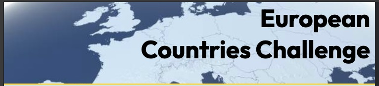

* Positioned at the top of the page.
* The position is fixed, so the header is always visible throughout the game.
* The name of the game is written on the right of the header.
    * The name is responsive, enlarging for bigger screen sizes.
* The background image for the header is a map of Europe.
   
---

- ### Footer

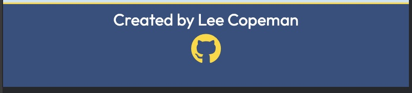

* The footer is positioned at the bottom of the page.
* It contains the author for the game.
* There is a link to the authors GitHub Page via an icon.
* The link has hover properties and opens in a new page.  

---

- ### Start section

* The page has a short paragraph informing the user what the game is about.
* It instructs users to enter their name and click start to begin the game.
* Names are to be entered inside the input field.
* If no name is entered before clicking start, an alert will pop-up to remind the user to enter a name.
* A circular button labelled 'Start' is clicked to begin the game.

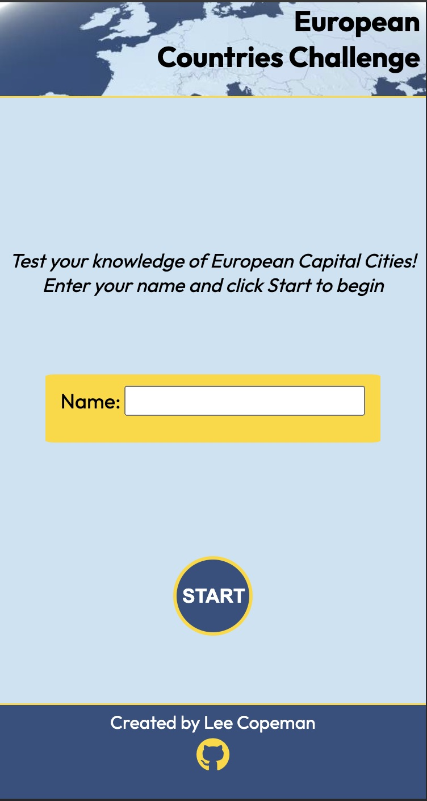

* The text is responsive, increasing in size for larger screen sizes.

---

- ### Questions section

* The question is displayed in large text within a golden yellow banner.
* There is an answer area where the user can input their answer.
* If no answer is entered, the user is alerted to enter an answer before continuing.
* There is a submit input to click to check the answer. (the user can also use the enter key).
* After an answer has been submitted it is checked and added to the score.

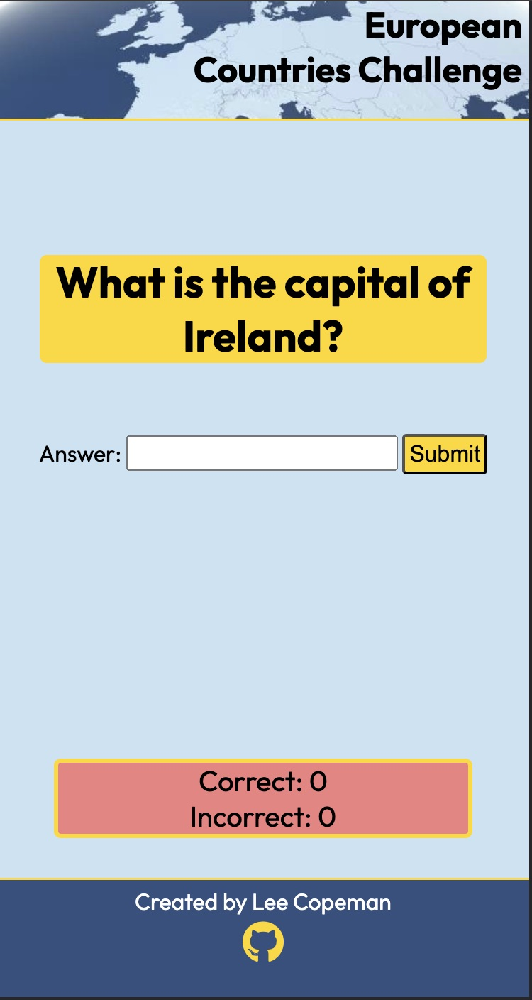

* Towards the bottom of the section is the score area.
* Correct scores are talleyed and displayed after a correct answer.
* Incorrect scores are talleyed and displayed after an incorrect answer.
* Another question is then shown.
* 10 questions are asked in total, before the game finishes.
* The text is responsive, increasing in size for larger screen sizes.

--- 

- ### Results section

* After 10 questions have been answered, the user is shown the results section.
* A personalised message is displayed, showing the users name and their final score.
* There is a button with a link to allow the user to play again.

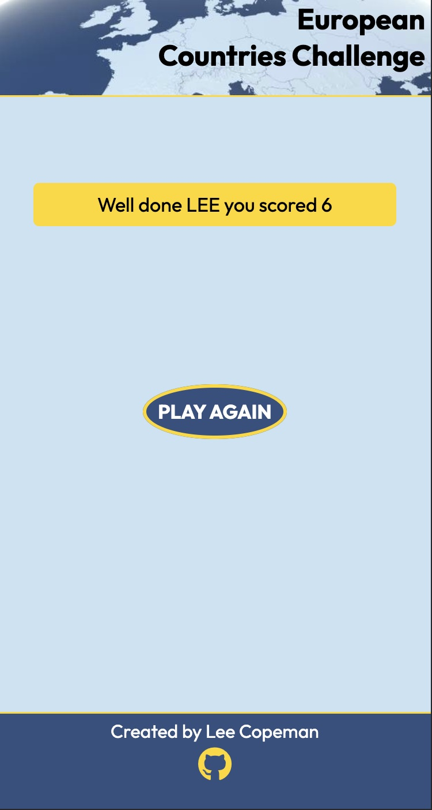

---

### Technologies Used

- [HTML](https://developer.mozilla.org/en-US/docs/Web/HTML) - was used as the foundation of the game.
- [CSS](https://developer.mozilla.org/en-US/docs/Web/css) - was used to add the styles and layout of the game.
- [JavaScript](https://developer.mozilla.org/en-US/docs/Learn/javascript) - was used to arrange items on the pages.
- [Balsamiq](https://balsamiq.com/) - was used to make wireframes for the game.
- [Miro](https://miro.com/app/) - was used to create a workflow.
- [Gitpod](https://www.gitpod.io/) - was used as the main tool to write and edit code.
- [GitHub](https://github.com/) - was used to host the code of the website.
- [PineTools](https://pinetools.com/) - was used to find colors from image.

---

## Design

### Colour

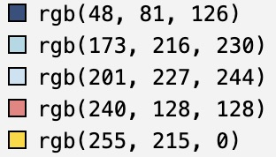

* The shades of blue were taken from the image and used throughout the styling of the game.
* The main background of the game is the lighter blue from the image.
* The dark blue is used for the footer and the buttons.
* A golden yellow was used as a banner for the name area and when displaying questions, as well as some border styling. It was chosen as it contrasts well with the blue. The blue and gold also have associations with Europe from the flag of the European Union.
* A coral shade of pink was used for the score area. This ensures the area stands out and contrasts well with the light blue background.

### Typography

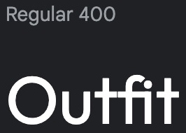

* Outfit was used as the main font of the game in order to increase readability of the content on the pages.

### Wireframe

* I used Balsamiq to create a wireframe of my idea

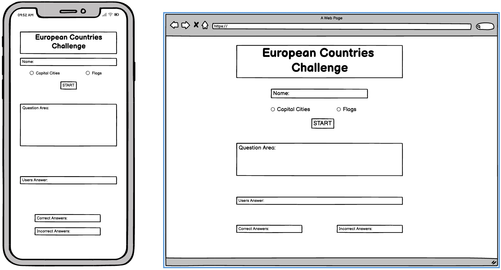

---

## Testing

### Compatibility

In order to confirm the correct functionality, responsiveness and appearance the gane was tested on: 

* Chrome

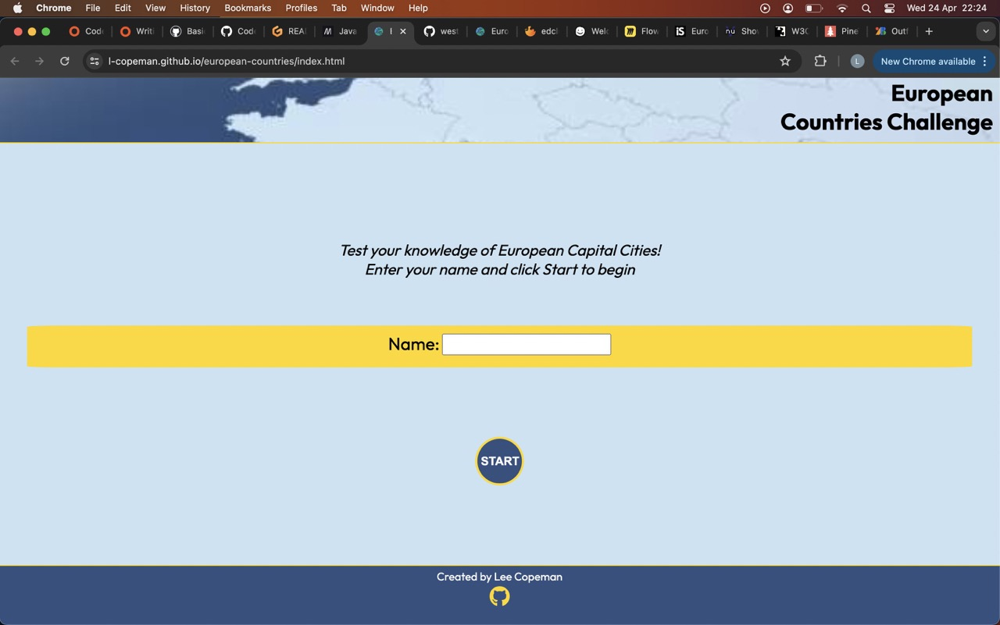

* Safari

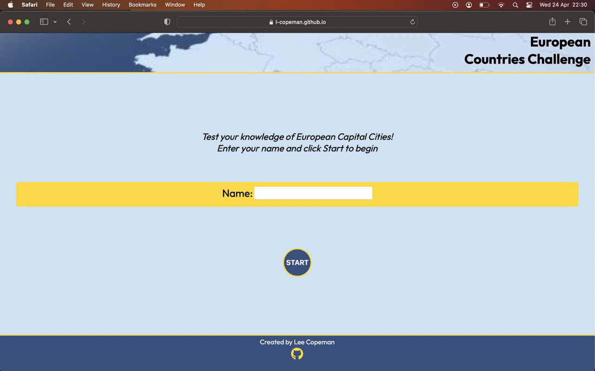

* Firefox

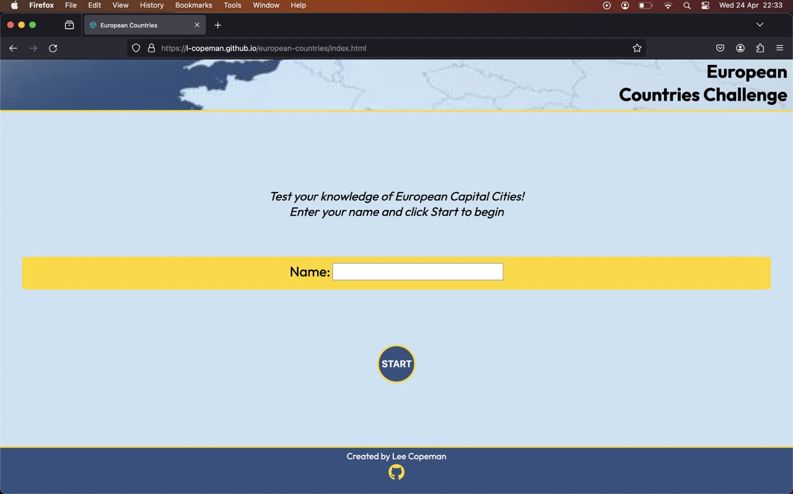

### Responsiveness

In orfer to cofirm the responsiveness of the game, devtools was used to check the game on different screen sizes:

* Phone

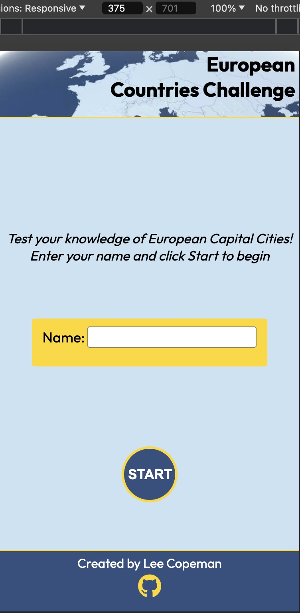 

* Tablet

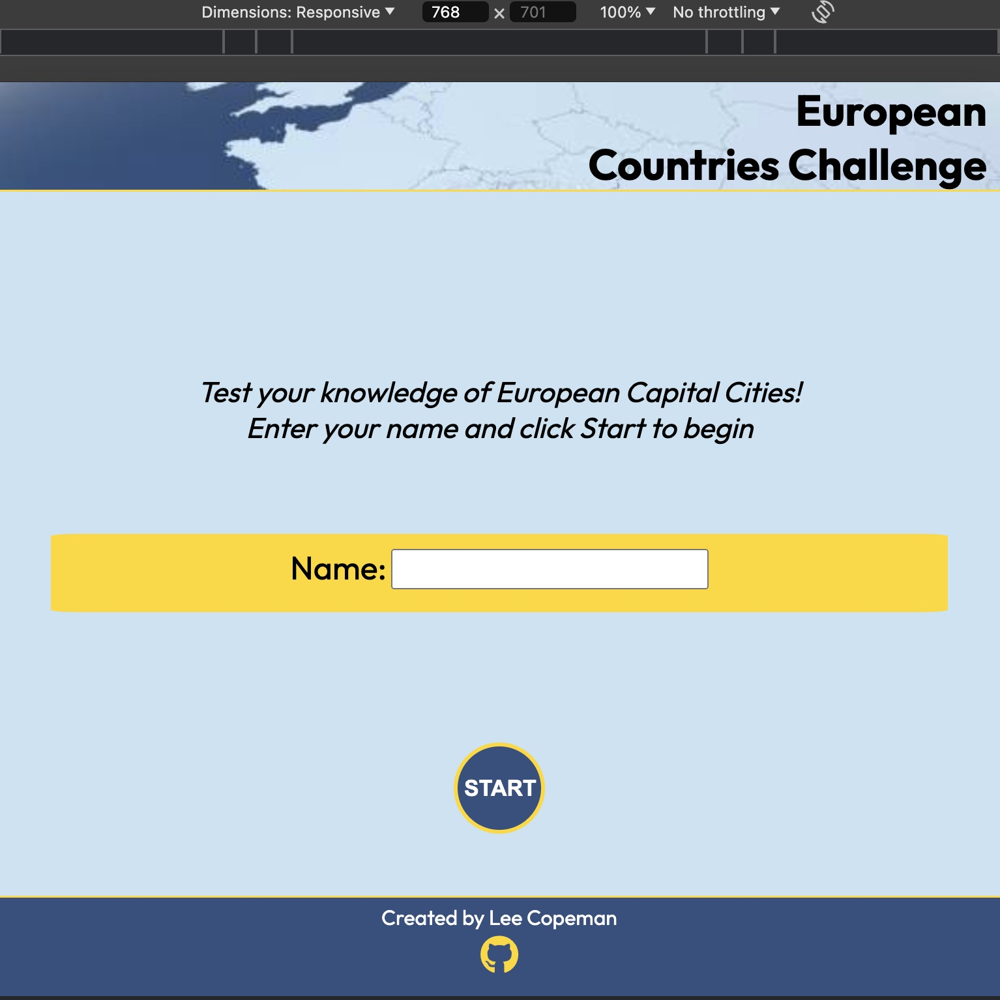

* Laptop

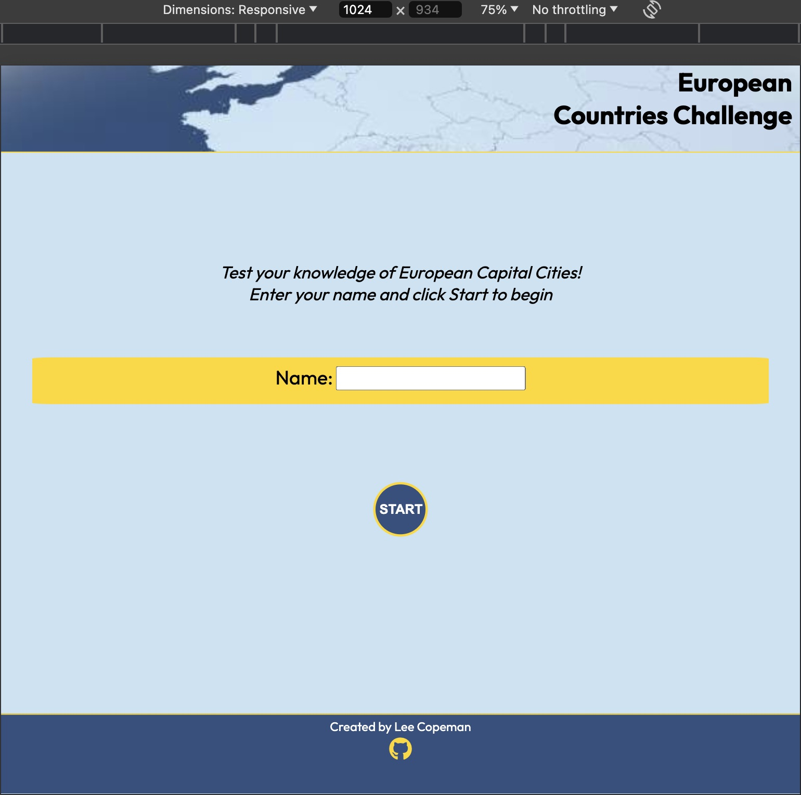

### Validator Testing

- #### HTML

No errors or warnings were found when passing through the official W3C validator.

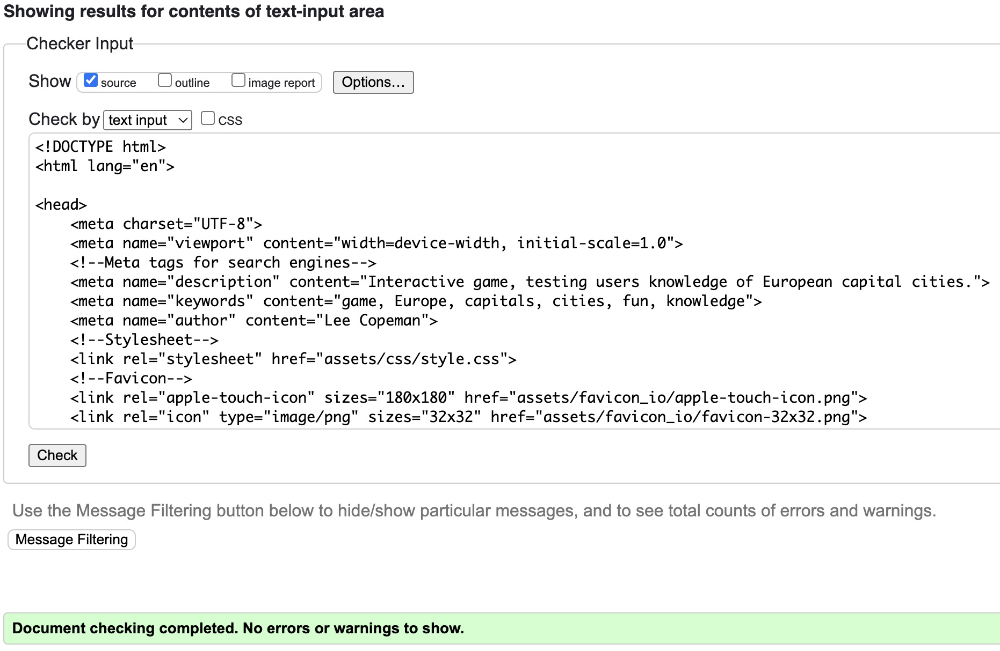

- #### CSS

No errors or warnings were found when passing through the official W3C (Jigsaw) validator.

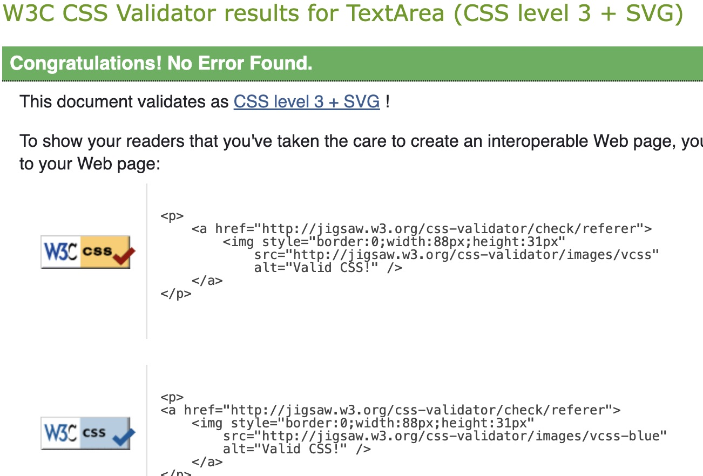

- #### JavaScript

No errors or warnings were found when passing through the official jshint validator.

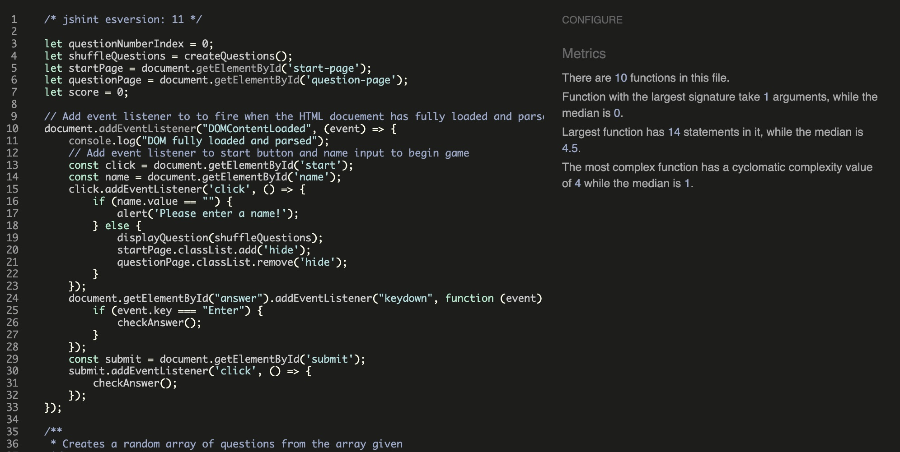

---

### Lighthouse Report

* #### Home Page

* #### Classes Page

* #### Sign-up Page

* #### Responses Page

---

### Manual Testing

Maunal tests carried out by multiple users:

* Home link
* Classes link
* Sign-up link
* Facebook link
* X link
* Instagram link
* Monday link
* Tuesday link
* Wednesday link
* Thursday link
* Friday link
* Boppin' Tots webpage link
* Tappy Toes Dance link
* Wriggle and Rhyme link
* Little Theatre on The Hill link
* La Ola Spanish link
* First name required
* Second name required
* Email required
* Age of children required
* Submit link 
* Back to Home Page link   

### Bugs

#### Solved bugs

* As I was testing the responsiveness for larger phones and above, I noticed the title in the header wrapped onto one line, hence revealing white space between the header and main section. To resolve this I had to change the marin-top of the main section to reduce this space.

* The landing image on the main page was pixelated on larger screen sizes. I had to replace this image with a higher resolutiuon image to solve the issue.

* When checking the html code through the validator, I had an error where there was an `<a>` element within a `<button>` element. This is not good for user accessibility. To resolve this I removed the button element, and just used an `<a>` tag and used CSS styling to get the desired effect.

#### Unresolved bugs

* On the classes page I have the days of the week listed as links to the relevant classes for that day. When clicking on a certain day, it takes you to the section but the title for that day is hidden beneath the header. I would have liked this to be visible. To resolve this I would look at repositioning the target id, so the day of the week heading is visible.

## Deployment

### Deployment to GitHub Pages

- The site was deployed to GitHub pages. The steps to deploy are as follows: 
  - In the [GitHub repository](https://github.com/l-copeman/west-norwood-parenting), navigate to the Settings tab 
  - From the source section drop-down menu, select the **Main** Branch, then click "Save".
  - The page will be automatically refreshed with a detailed ribbon display to indicate the successful deployment.

The live link can be found [here](https://l-copeman.github.io/european-countries/index.html)

---

## Future Improvements

* I would like to add more classes for each specific day of the week
* I would like to gain feedback from users experience of the site, and after joining the community. I would look at incorporating this information into the site to show past user experience for new users. 

---

## Credits

#### Images

All images were taken from:
* [Pexels](https://www.pexels.com/)
* [Unsplash](https://unsplash.com/)

---

## Acknowledgements

* [Code Institute](https://codeinstitute.net/) tutors, mentor and Slack community members for their support and help.
* Cristina Bonilla, my partner, for her support, design guidance and help with testing.